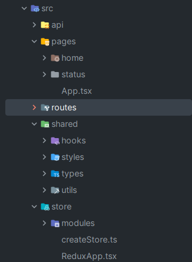

<div align="center">
<h1 align="center">Geolocation</h1>
</div>

## Antes de começar:

Algumas informações importantes serão passadas nesse trecho:


- Foi utilizado o [React Native](https://reactnative.dev/) CLI  para o desenvolvimento do aplicativo.
<br>
Será necessário instalar o React Native CLI para executar o projeto.
<br>
Link para instalação: https://reactnative.dev/docs/environment-setup


- Foi utilizado o [Docker](https://www.docker.com/) para executar o banco de dados.


- Foi utilizado o [ngrok](https://ngrok.com/) para expor a API localmente.
<br>
será necessário instalar o ngrok e executar o comando abaixo para expor a API localmente.
<br>


    docker run --net=host -it -e NGROK_AUTHTOKEN=xyz ngrok/ngrok:latest http 8081
  

<br>
caso não possua uma conta no ngrok, crie uma e substitua o `xyz` pelo seu token.
<br>

certifique-se de que o ngrok está rodando na porta 8081.
<br>

certifique-se de modificar o endereço da API no arquivo `geolocation/src/api/index.ts` para o endereço exposto pelo ngrok.


- Foi utilizado o [Redux](https://redux.js.org/) para gerenciar o estado da aplicação.


- Foi utilizado o [React Navigation](https://reactnavigation.org/) para gerenciar as rotas da aplicação.


- ### A imagem abaixo mostra o fluxo de telas da aplicação:



## Executando o projeto react native:

Para executar o projeto react-native, siga os passos abaixo:

1. Clone o repositório:
    ```sh
    git clone https://github.com/miguelwiest/vaga-contele.git
    ```
2. Entre na pasta do projeto react native:
    ```sh
    cd geolocation
    ```
3. Instale as dependências:
    ```sh
    npm install
    ```
4. Execute o projeto:
    ```sh
    npx react-native run-android
    ```
   
## Executando o banco de dados:

Para executar o banco de dados, siga os passos abaixo:

1. Entre na pasta do projeto docker:
    ```sh
    cd api-geolocation
    ```
2. Execute o projeto:
    ```sh
    docker-compose up --build
    ```